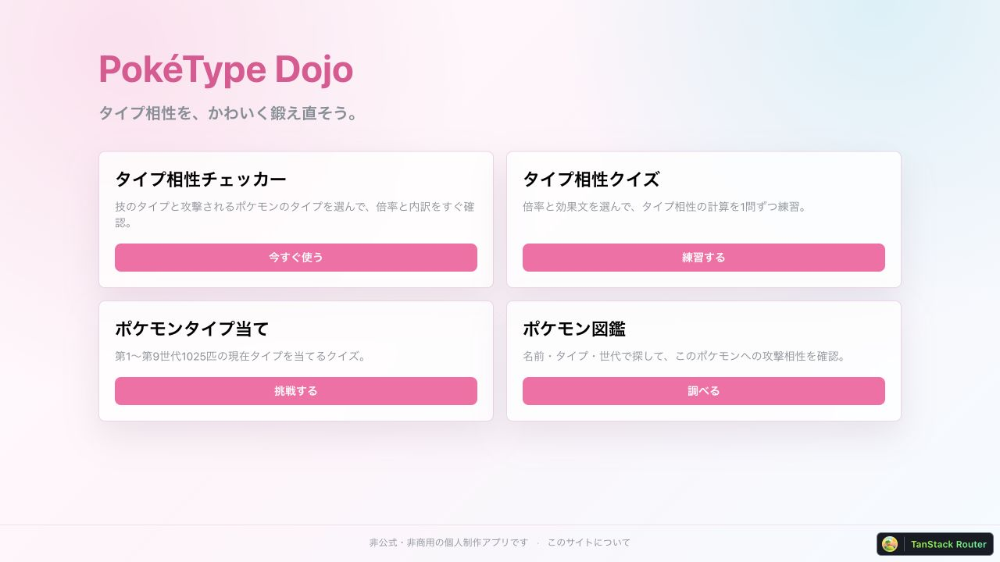
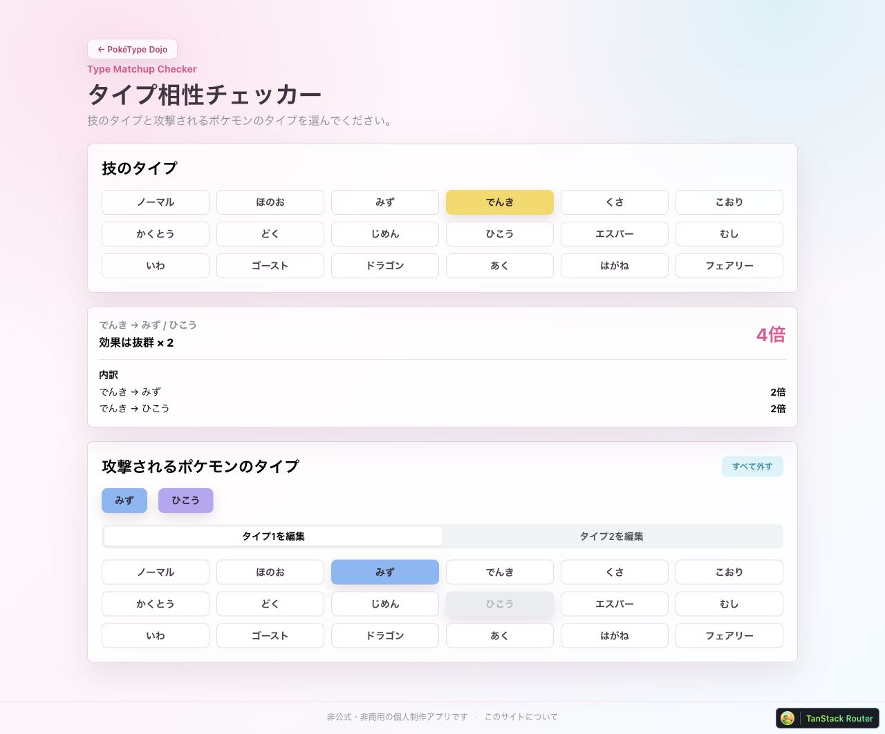
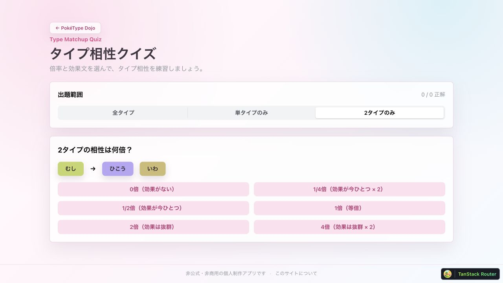
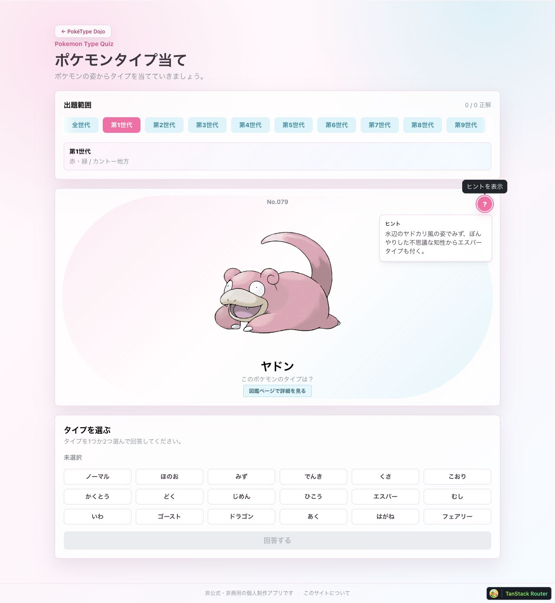
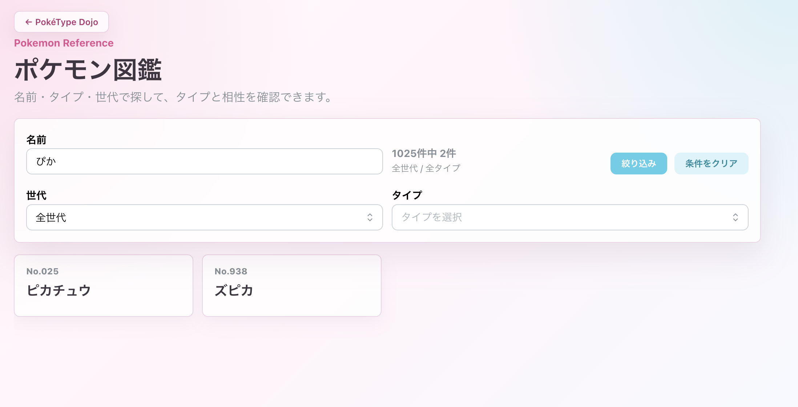
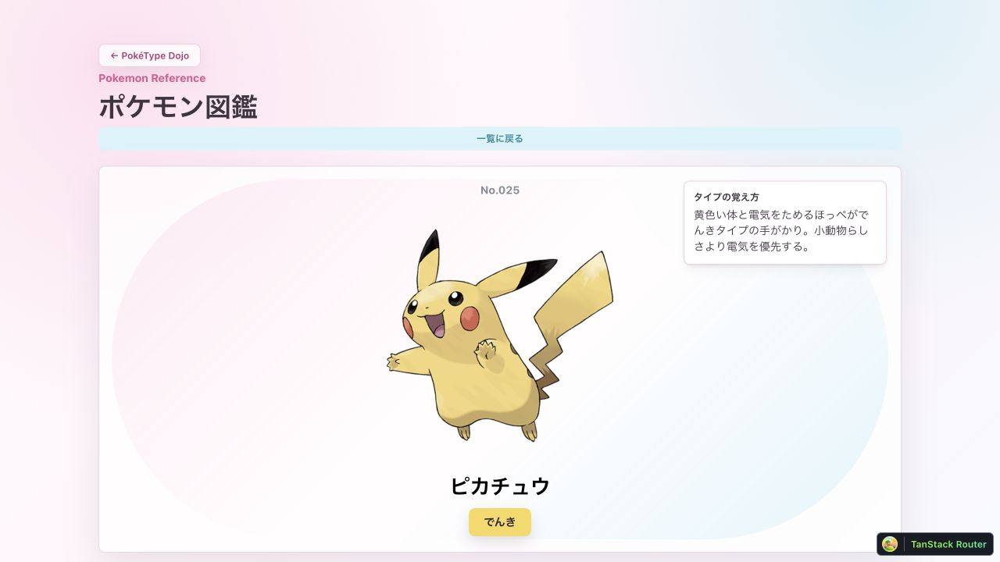

## はじめに

今年の頭に[ポケモンZ-A](https://www.pokemon.co.jp/ex/legends_z-a/ja/)を購入しました。私はダイアモンド・パール（2006年発売）を最後にポケモンをやっていなかったため、フェアリータイプをそもそも知らなかったり、新しいポケモンが多すぎて全然タイプがわかりませんでした。
そこで、タイプ相性やポケモンのタイプを学習するアプリ「[PokéType Dojo](https://poketype-dojo.netlify.app/)」を作ってみました。
:::details

*https://www.pokemon.co.jp/ex/legends_z-a/ja/features/250227_01/*
ちなみにZ-Aでは新しい戦闘方法になっており、相手のポケモンに攻撃する技の相性が⚪︎や△などで表示されるため、タイプをちゃんと覚えずともクリアすることはできました笑
:::

上記以外に、主に以下のような目的を基にアプリを作っています。
- tanstack startを使う
- vite+を使う
- どこかにデプロイして、誰かに使ってもらえるような機能を持ったアプリにする
- Codexをがっつり使ってアプリを作る

この記事はアプリの簡単な機能や技術部分をざっくりと紹介するような記事になっています。



:::message
PokéType Dojoは非公式・非商用の個人制作アプリです。株式会社ポケモン、任天堂株式会社、株式会社クリーチャーズ、株式会社ゲームフリーク、およびその関連会社とは関係ありません。
:::

## PokéType Dojoでできること

現在は、大きく4つの機能があります。

### タイプ相性チェッカー

技のタイプと、攻撃されるポケモンのタイプを選ぶと、最終的な倍率と計算の内訳を確認できます。

たとえば「でんき → みず・ひこう」なら `2倍 × 2倍 = 4倍`、「でんき → みず・じめん」なら、じめんタイプによって最終結果は `0倍` です。

2つの防御タイプはスロット式にしており、片方を固定しながらもう片方だけを変えて比較できます。選択状態はURLのsearch paramsに入るので、同じ条件をそのまま共有することもできます。不正な値や同じタイプの重複がURLに入った場合は、安全な状態へ補正して通知します。



### タイプ相性クイズ

単タイプ、2タイプ、または両方を混ぜた問題に1問ずつ回答します。



### ポケモンタイプ当てクイズ

ポケモンの姿を見て、1つまたは2つのタイプを選びます。第1世代から第9世代まで、全国図鑑No.1〜1025の通常個体を収録しています。

このアプリで扱うのは登場当時のタイプではなく、現在の標準フォームのタイプです。たとえばピッピはフェアリー、コイルはでんき・はがねとして出題されます。また、1025匹すべてに「タイプの覚え方」を用意し、迷ったときはヒントとして開けるようにしました。
（ヒントは「タイプの覚え方」として、AIに作らせましたが、見たらほぼ答えがわかっちゃうくらいの内容にはなってますね笑）



### ポケモン図鑑

名前・タイプ・世代で絞り込み、各ポケモンのタイプと「そのポケモンに対して何タイプの技が何倍になるか」を確認できます。日本語名の検索では、ひらがなとカタカナを同一視していて「ぴか」でもピカチュウが見つけられるような部分一致検索になっています。



例えばピカチュウのカードをクリックすると下図のように表示され、そのポケモンのタイプに関する情報が出てきます。


## CodexアプリとSkillを使って計画した

開発は、いきなり画面を作り始めるのではなく、[Codexアプリ](https://developers.openai.com/codex/app/features)上でアプリの目的とスコープを整理するところから始めました。

初期案の整理のために、[grill-with-docs](https://www.skills.sh/mattpocock/skills/grill-with-docs)というSkillsを使いました。曖昧な言葉や未決定事項を一問ずつ掘り下げ、既存のコードやドキュメントと照合しながら計画を固めるためのワークフローを定義しています。

Codexとの対話を通して、たとえば次のようなことを決めました。

- 最低限完成させるのは、トップページとタイプ相性チェッカー
- 2タイプの最終倍率は、それぞれへの倍率を掛け算して求める
- 実行時の外部APIに依存しないよう、相性データを静的なTypeScriptとして持つ
- 18×18の巨大な表より、まずは触って確かめられるチェッカーとクイズを優先する

最初にデータの形と用語を決めたあとは、Codexアプリで実装と差分を確認しながら、チェッカー、クイズ、図鑑へと機能を広げていきました。計画とコードを同じリポジトリの文脈で扱えるため、設計時の判断を実装へつなげやすかったです。

## 1025匹のデータ収集と「タイプの覚え方」もCodexで

このアプリで特に大きかった作業が、第1世代から第9世代まで、1025匹分のポケモンデータを揃えることでした。

全国図鑑番号、日本語名、英語識別名、現在の標準フォームのタイプ、画像パス、世代情報を、Codexを使って世代ごとのTypeScriptファイルにまとめました。リージョンフォームやメガシンカなどは混ぜず、「現在の標準フォームを1匹につき1レコード」というルールに揃えています。

データ追加を毎回同じ手順で進められるよう、リポジトリには `add-pokemon-generation-data` という専用Skillも作りました。このSkillには、公式情報を優先して確認すること、信頼できる二次情報でも大きな表を照合すること、図鑑番号の範囲、フォームの扱い、追加後に必要なテストなどを書いています。

さらに、各ポケモンにはCodexに考えてもらった短い「タイプの覚え方」があります。これは単に「くさ・どくタイプ」と答えを書くのではなく、見た目、名前、モチーフ、進化系との関係などから、覚えるための手がかりを説明する文章です。

もちろん、1025匹分のCodexによる生成結果をそのまま正しいものとして扱っているわけではありません。図鑑番号が1〜1025まで連続しているか、重複がないか、タイプ値が有効か、現在タイプへ変わった代表的なポケモンが正しいかをテストし、データの形を機械的に検証しています。

1025匹ものデータを集めたり、「タイプの覚え方」を全ポケモン分考えるという重労働もCodexがいい感じにこなしてくれて、とても助かりました。

## 技術構成

主な技術は次のとおりです。

- React 19 + TypeScript
- [TanStack Start](https://tanstack.com/start/latest)
- Mantine v9
- Vite+
- Netlify

UIはMantineをベースにしつつ、キャンディカラー、ガラス風パネル、タイプごとの色を組み合わせたライトテーマを作りました。

### TanStack Startを使ってよかったところ

特によかったのは、URLを単なる文字列ではなく、型の付いたアプリの状態として扱えることです。各Routeの `validateSearch` で外部から来た値を検証すると、`Route.useSearch()` や画面遷移でもその型が引き継がれます。チェッカーの選択状態やクイズの出題範囲を、再読み込みやURL共有に強い形で実装できました。

また、TanStack StartはRouter-firstでありながら「client-authored, server-powered」を掲げています。今回は静的データとブラウザ上の操作が中心なので、画面は普段のReactと純粋関数を中心に素直に書き、ルーティングやSSR、Netlify向けの出力はフレームワークに任せられました。小さくクライアント主体で始めつつ、必要になればloaderやServer Functionsへ広げられるのも扱いやすい点だと感じました。

### なぜNetlifyへデプロイしたのか

デプロイ先にNetlifyを選んだ一番の理由は、TanStack Startを簡単に動かせそうだったからです。Netlifyは[TanStack Startを公式にサポート](https://docs.netlify.com/build/frameworks/framework-setup-guides/tanstack-start/)しており、専用の `@netlify/vite-plugin-tanstack-start` が用意されています。SSR、Server Routes、Server Functions、middlewareもNetlify Functionsへ変換してデプロイできます。

このアプリでもVite設定へpluginを追加し、`netlify.toml` にはほぼ次の設定だけを書いています。

```toml
[build]
command = "vp build"
publish = "dist/client"
```

GitHubと連携すればpushからビルドと公開まで進み、Pull RequestではDeploy Previewも確認できます。TanStack Start側の公式例にも「Deploy to Netlify」が用意されているため、まず試して公開するまでの距離が短い点が魅力でした。

残念だったのは、FreeプランではFunctionsの実行リージョンを日本へ指定できない点です。Netlify Functionsには東京を表す `nrt` リージョンがありますが、[リージョン指定はPro／Enterpriseプラン向け](https://docs.netlify.com/build/functions/configuration/#region)です。

静的なJavaScriptや画像はグローバルCDNから配信されるため、「サイト全体が日本から遠い場所だけで配信される」という意味ではありません。ただし、TanStack StartのSSRや将来追加するServer Functionsの実行場所を、Freeプランでは東京へ寄せられません。このアプリはブラウザ側の処理が中心なので大きな問題にはなっていませんが、日本向けのアプリとしては少し惜しいポイントでした。

### 共通ロジックと静的データ

相性計算はReactコンポーネントから切り離した純粋関数です。同じ `getFinalMultiplier` をチェッカー、2種類のクイズ、図鑑詳細で再利用しているため、画面ごとに計算方法がずれにくくなっています。代表的な4倍・0倍・1/2倍などはユニットテストで固定しています。

ポケモンと相性のデータは、静的なTypeScriptとして同梱しています。外部サービスの状態に左右されず、クイズと図鑑で同じデータを使える構成です。

一方で、1025匹分のデータをトップページの初期表示にすべて含める必要はありません。ポケモン機能へ進むときだけdynamic importし、カードへのhover/focusで先読みするようにしました。「静的データにして安定させる」と「最初から全部読み込む」は別の話として扱っています。

## Codexとの開発を支えたVite+の品質ゲート

この開発では、Codexにコードやデータを書いてもらう速さだけでなく、その変更を小刻みに検査できることを重視しました。その中心に置いたのが[Vite+](https://viteplus.dev/)です。

Vite+は、開発サーバー、ビルド、テスト、Lint、フォーマット、型チェック、パッケージ管理などを `vp` コマンドにまとめたツールチェーンです。このプロジェクトでは、作業後の基本コマンドを次の2つに揃えています。

```bash
vp check
vp test
```

`vp check` では、フォーマット・Lint・型チェックをまとめて実行します。設定は `vite.config.ts` に集約しており、`vp check` 一発で機械的に検出できる問題を洗い出せます。

Codexは短時間で広い範囲を変更できますが、そのぶん「見た目は動くけれど型が崩れている」「未使用コードが残った」「Reactとして避けたい書き方になった」といったことも起こり得ます。最後に人間が勘で探すのではなく、まず `vp check` に集めています。

### コミット前にも自動で確認する

Vite+のcommit hooksも利用しています。`vp config` でGit hookを設定し、pre-commitでは `vp staged` を実行します。

```ts
staged: {
  "*.{js,jsx,ts,tsx,json,css}": "vp check --fix",
}
```

これにより、コミット対象のコードや設定ファイルには自動修正とチェックがかかります。Codexが変更したファイルも、人間が変更したファイルも同じ入口を通ります。

さらに、`develop` へのPull RequestとpushではGitHub Actionsが以下を実行します。

```bash
vp install
vp check
vp test
```

ローカルのpre-commit、CI、Pull Requestの必須チェックという複数の層にすることで、hookを通らなかった変更もCIで止められます。`develop` から `main` へリリースする際はNetlify Deploy Previewで実際の画面を確認し、マージ後に本番へ反映します。

もちろん、チェックが通れば仕様やデータが必ず正しいわけではありません。そこで、タイプ相性の代表ケースや1025匹のデータ構造はテストで守り、判断の前提はドキュメントに残し、UIはDeploy Previewで人間が確認する、という役割分担にしています。

## AGENTS.md

もうひとつ効果が大きかったのが、Codex向けのプロジェクトルールを [`AGENTS.md`](https://developers.openai.com/codex/guides/agents-md) に置いたことです。Codexは作業前にこのファイルを読み込むため、毎回の会話で同じ約束を説明し直さずに済みます。

たとえばこのプロジェクトでは、パッケージマネージャーを直接使わずVite+経由で操作すること、変更後は必ず `vp check` を実行すること、テストでは `vite-plus/test` からimportすることなどを明記しています。

## まとめ

今回は技術の深い話というよりはこんなスタックでアプリ作ってみたという内容と、アプリの簡単な紹介記事でした。誰でも触れるアプリにしてるので、試しに遊んでもらえると嬉しいです！

アプリ: [PokéType Dojo](https://poketype-dojo.netlify.app/)  
ソースコード: [GitHub](https://github.com/shimpei1494/poketype-dojo)

最後まで読んでいただき、ありがとうございました！


